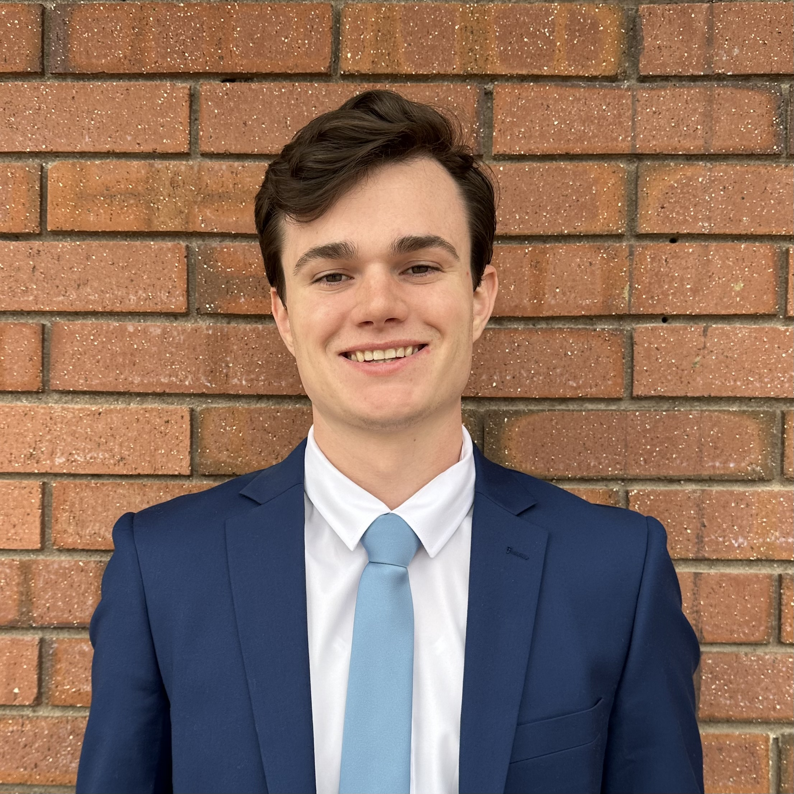

::: {.columns}

::: {.column width="65%"}
## I turn data into insights, models, and solutions for real-world problems.

I'm a Statistics student at **Brigham Young University** specializing in Data Science, with a particular interest in using statistics, machine learning, and technology to help organizations make better decisions.

I'm currently completing my B.S. in Statistics and will begin a **Master's in Statistics at BYU in Fall 2026**.
:::

::: {.column width="35%"}
{fig-align="center" width="80%"}
:::

:::
---

## Projects

### 🎬 Movie Recommendation System

I built a movie recommendation system with a team of 2 others to predict whether a user would like a movie. We compared traditional machine learning methods such as logistic regression and KNN with a neural network using user and movie embeddings.

The neural network achieved an **F1 score of 0.897**, substantially outperforming the baseline models.

**Tools:** Python · pandas · scikit-learn · PyTorch

[View Project →](https://github.com/chamiltonb8/STAT_486_final_proj/tree/main)

---

### 🐀 New York Rat Case Competition

**2nd Place — Case Competition**

Analyzed reported rat complaints in New York City to determine where rat problems were concentrated, what factors were associated with rat activity, and how the city could address the problem.

Our team used geographic analysis, data visualization, linear regression, and random forest modeling to turn the data into actionable recommendations.

[View Project →](https://docs.google.com/presentation/d/1tzXx27ziEVCkIKVPPFrrYlTtKYtOuI91d7MYrJ9xHPo/edit?slide=id.g3d3c87929d0_1_61)

---

### 📊 Medline Data Analysis

Analyzed Medline data using statistical and data science techniques to identify patterns and relationships within the data.

This project gave me experience working through the process of exploring, cleaning, analyzing, and communicating findings from a real dataset.

[View Project →](#)

---

### 🤖 Employee Scheduling Automation

**In Progress**

Exploring how AI agents could help businesses automate employee scheduling by considering employee availability, preferences, and business requirements.

I'm approaching this project from a business-problem-first perspective: understanding the current scheduling process, identifying where businesses lose time or money, and determining whether AI can provide meaningful value.

**Tools:** Python · AI Agents · Optimization · Automation · APIs

[View Project →](#)

---

### 🔬 Neural Network & Information Theory Research

As a research assistant at BYU, I study machine learning, information theory, entropy, and neural networks.

My current research involves using information-theoretic methods to study representations learned by neural networks and investigate ways to improve how models distribute and use information. One goal of my research is to replace the current dropout method used by neural networks with a "pin-pointed" dropout method to improve accuracy and reduce training time.

**Tools:** Python · PyTorch · PCA · Information Theory

[View Project →](#)

---

## Skills

### Programming & Data Science

- Python
- R
- SQL
- pandas
- NumPy
- scikit-learn
- PyTorch
- Excel

### Machine Learning & Statistics

- Regression
- Classification
- Random Forests
- Neural Networks
- PCA
- Feature Engineering
- Data Preprocessing
- Statistical Analysis
- Information Theory

### Tools & Workflow

- Git
- Jupyter
- VS Code
- APIs
- Data Visualization
- Quarto

---

## Personally Interested In

I'm particularly interested in the intersection of **data science, machine learning, and business**.

I'm interested in problems such as:

- Using data to improve business decisions
- Understanding customer behavior
- Finding inefficiencies in business processes
- Predicting outcomes and identifying trends
- Automating repetitive work
- Building AI systems that solve practical problems
- Using statistics and machine learning to turn data into useful insights

I'm especially interested in opportunities where I can work with real data and see how my analysis can have a measurable impact.

---

## Let's Connect

I'm currently interested in opportunities in **data science, analytics, machine learning, and business-focused problem solving**.

**Email:** [atwoodridge@gmail.com](mailto:atwoodridge@gmail.com)

**Location:** Provo, Utah

[GitHub](#) · [LinkedIn](www.linkedin.com/in/ridge-atwood)